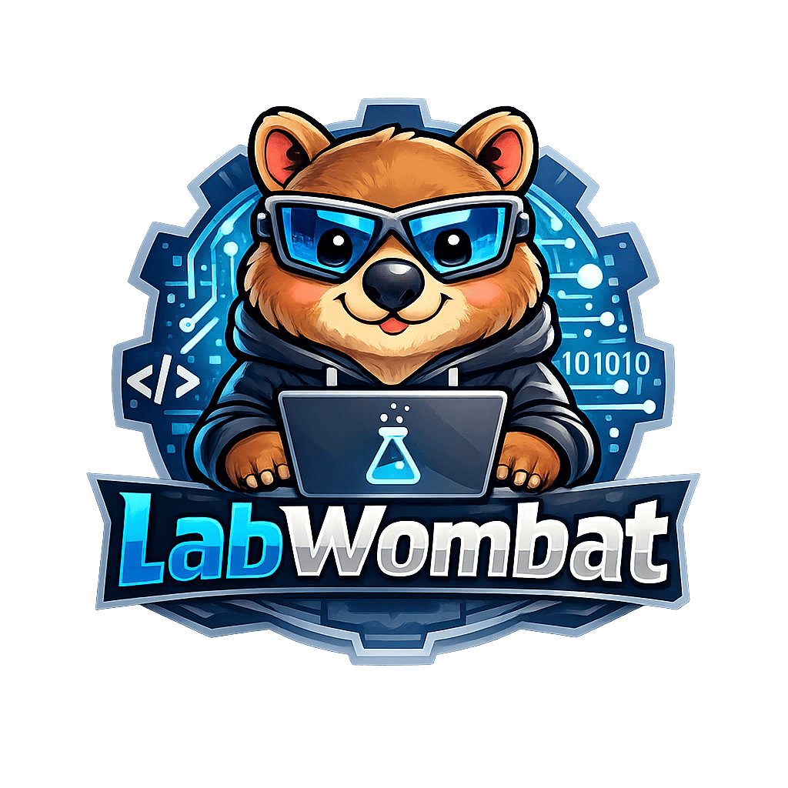

# 🚀 LabWombat Technical Study

> **"구현을 넘어 설계의 본질(Trade-off)을 꿰뚫는 토론을 지향합니다."**
> 모든 학습 로그, 토론 기록, 지식 정리본은 **[LabWombat Wiki](../../wiki)**에서 통합 관리합니다.
**2026.02 -**
---

## 📂 Study Subjects
현재 진행 중인 과목과 학습 목표입니다. (각 폴더명을 클릭하면 상세 내용으로 이동합니다.)

| Subject | Goal | Status |
| :--- | :--- | :--- |
| [**🏗️ MSA**](https://github.com/LabWombat/Study-Archive/wiki/MSA-Home) | 서비스 분리 전략과 분산 트랜잭션의 이해 | 🟢 Phase 1 진행 중 |
|
---
## 🛠️ Study Protocol (Common)
모든 스터디는 아래의 공통 폴더 구조를 따르며, **AI-Native**한 방식으로 지식을 축적합니다.

- **00-resources**: 기업 블로그, 논문 등 외부 자료 아카이빙 (파일당 아티클 1개)
- **01-individual**: 개인별 학습 노트 및 질문 리스트 (Input)
- **02-discussion**: 스터디 당일 토론 기록 및 인사이트 (Output)
- **03-summary**: 스터디 종료 후 최종 핵심 정리본 (Knowledge Base)

---

## 👥 Contributors
| [@ktodw98](https://github.com/ktodw98) | [@hsuncho](https://github.com/hsuncho) | [@eeyoungsong](https://github.com/eeyoungsong) |
| :---: | :---: | :---: |
|  |  |  |
| Product Manager / Gopher | Backend Developer | Backend Engineer |

---
## 📄 License
This project is licensed under the [MIT License](./LICENSE).